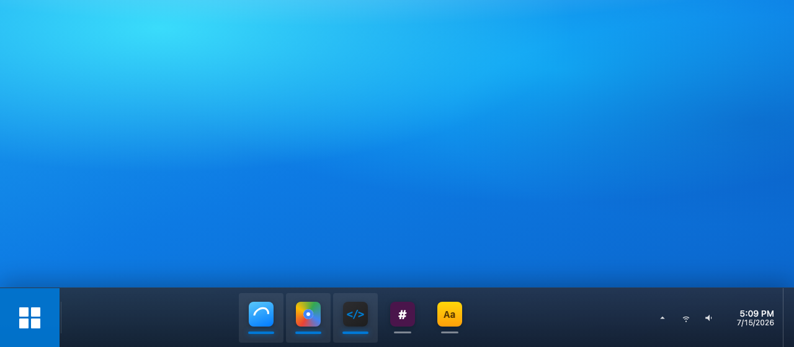

# Better Mac Taskbar



A Windows 10–style taskbar for macOS. Native Swift / AppKit accessory app (menu bar + bottom bar, no Dock required).

 

## Features

- Frosted-glass bottom taskbar
- Per-window icons (Chrome / multi-window apps show separately)
- Center or left-aligned icons
- Start menu with pinned apps and type-to-search across installed apps (configurable Start hotkey; default Windows / ⌘ alone unhides the taskbar)
- Clock, tray, Show Desktop
- Right-click: Close, Minimize, Pin, Hide, New window, Quit
- Middle-click closes a window
- Optional Dock replacement (Dock fully hidden while running; restored on quit)
- Optional auto-hide taskbar
- Launch at login
- App log file for diagnosing unexpected quits (`~/Library/Logs/BetterMacTaskbar/app.log`)

## Requirements

- macOS 13 or later
- Apple Silicon (arm64) — build script targets `arm64-apple-macosx`
- Xcode Command Line Tools (`xcode-select --install`)

## Build & run

```bash
git clone https://github.com/JosephAHK/better-mac-taskbar.git
cd better-mac-taskbar
./build.sh
open "build/Better Mac Taskbar.app"
```

`build.sh` compiles all Swift sources, packages an `.app` bundle, and codesigns it (Apple Development identity if available, otherwise a stable local identity, otherwise ad-hoc).

## Permissions

Grant **Accessibility** in **System Settings → Privacy & Security → Accessibility**.

Use the menu bar icon → **Grant Accessibility…** if needed. Without Accessibility, the taskbar falls back to one icon per app instead of per window.

After a rebuild, macOS may keep the Accessibility toggle on but stop trusting the new binary — turn it **off then on** for Better Mac Taskbar, then choose **Refresh Windows**.

Automation permission may also be requested the first time the app raises or minimizes scriptable windows (e.g. Chrome).

## Settings

Menu bar icon → **Settings…**, or Start → Settings:

- Center taskbar icons
- Hide Dock (use taskbar instead)
- Automatically hide the taskbar
- Start menu hotkey (click to record; Reset restores ⌘ / Windows key)
- Launch at login
- Verbose logging (see [Logs](#logs))

## Project layout

```
Sources/          Swift / AppKit source
Resources/        Info.plist, app icon
build.sh          Compile, package, sign
build/            Generated .app (gitignored)
```

## Logs

Runtime diagnostics are written to:

```
~/Library/Logs/BetterMacTaskbar/app.log
```

Rotates at 4 MB, keeping `app.1.log` and `app.2.log`.

`INFO` and above is always logged: window activations, minimize/close and which
fallback path actually worked, hotkey and tray clicks, settings changes, Dock
mode changes, and every AppleScript / Accessibility failure.

`DEBUG` is off by default because the window poll runs about three times a
second. Turn it on in **Settings → Verbose logging** (or launch with
`BMT_VERBOSE_LOG=1`) to also get window enumeration results, drop reasons for
windows that never became icons, window-id remaps, and timings for slow AX /
AppleScript calls.

### Reporting a problem

1. Enable **Settings → Verbose logging**.
2. Reproduce the problem.
3. Menu bar icon → **Copy Diagnostics** — puts app state (permissions,
   settings, current windows) plus the last 200 log lines on the clipboard.

**Reveal Log in Finder** in the same menu opens the full log.

## License

MIT
